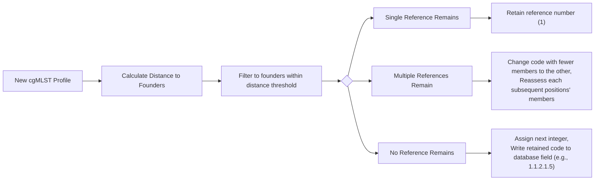

# AlleleCodes

Python script(s) for assigning allele codes under current PulseNet nomenclature system in BioNumerics but as a command-line executable without BioNumerics dependencies

## Installation

### git

```bash
cd ~/bin
git clone git@github.com:gmaniscoo/AlleleCodes.git
export PATH=$PATH:~/AlleleCodes/scripts
```

## Usage

```text
Allele Code Assignment Algorithm:  Using input config file (--config) to denote names of core loci in a cgMLST scheme, assess nearest neighbor
                  distances of input allele profiles (--alleles) against legacy profiles contained in input data
                  diretory (--datadir) in a hierarchical method at organism-specific thresholds defined by input prefix (--prefix)
                  using tree file in data directory as a guide.
Required arguments:
  -a, --alleles:  new allele profiles (Key/StrainID in column 1, locus names as headers with allele numbers in rows beneath, starting in column 2)
  -c, --config:  text file containing names of core loci on separate lines with no header (i.e. all lines are considered locu names)
  -d, --datadir:  data directory (string:  folder where results will be saved it --no-save flag not given)
  -p, --prefix:  (string:  what will be appended in front of the Allele Code and subfolders in data directory where data is stored)

Optional args:
  --nosave:  if provided, tree and allele calls file(s) will not be saved, only results printed to terminal
  --verbose:  if provided, also print what is written to log file to terminal too
  -o, --output:  if provided, print results to file rather than terminal. Delimiter determined by extension (',' for csv, '\t' for tsv)
```

## Example

Example files are included in this repository for this example.

```bash
assignAlleleCodes_py3.6.py --alleles BN.tsv  --config ExampleData/coreLoci_CAMP.txt --datadir alleleCodesSave --prefix CAMP --output BN.newallelecodes.tsv
```

Most output files will be saved to `alleleCodesSave` in this example. The main output will be saved to `BN.newallelecodes.tsv` in this example. If you don't want to save anything into `alleleCodesSave`, then you can use the `--nosave` option.

## Output files

Some output files will have a prefix as designated by `--prefix`. Following our example, files with a prefix in this table with simply have `CAMP` as the prefix. For these files, you will also notice that the prefix is joined to the rest of the filename with an underscore.

|file|what| Example |
|----|----| ------- |
|alleleCodes.tsv| A TSV file as designated with `--output`. Contains two columns: sample and allele code. | `SRR4280276      CAMP2.1 - 3.1.15.1.1.1` |
|CAMP_nomenclature_logs| This directory contains various log files| |
|CAMP_nomenclature_logs/CAMP_nomencalture_logs| This directory contains the actual log files from each run, allowing you to run the main script multiple times and aggregate results. | Filenames will have a timestamped format such as `wgst_log_2023-05-30@10-24-42.txt`. |
|CAMP_nomenclature_logs/change_log| This directory contains log files of how allele codes have changed over time. | The files are timestamped, e.g., `2023-05-30.tsv` |
|CAMP_nomenclature_srcfiles | source files | |

## Flowchart


